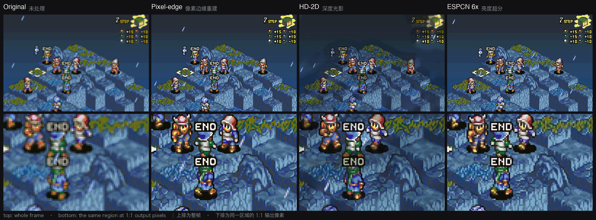

<div align="center">

# RetroAI-Scaler

**Real-time AI picture enhancement for RetroArch on Android handhelds**

[English](README.md) · [简体中文](README.zh-CN.md)

</div>

---

Retro games were drawn for tiny screens. On a modern handheld they get stretched
to fill a 1280×960 panel and end up soft and smeared. RetroAI-Scaler captures
RetroArch's picture at its **original resolution**, rebuilds it, and paints the
result back over the screen — live, at 60 FPS.



The same frame through four engines, captured on the handheld at 60 FPS. The
bottom row is where it shows: the original is a bilinear smear, **Pixel-edge**
rebuilds the diagonals the artist drew, **HD-2D** relights the scene from an
estimated depth map without touching a single one of those pixels, and
**ESPCN 6x** reconstructs luminance at exactly the factor the screen draws.

## Features

### Four upscalers

| Engine | Best for | Latency |
| --- | --- | --- |
| **Pixel Edge Reconstruction** | 2D sprite art — GBA, GBC, FC, SFC, MD | none |
| **GPU Sharpen** | a harder, more raw look | none |
| **ESPCN Fast / HQ** | PS1, 3D, gradients and dithering | +1 frame |
| **ESPCN Ultra** | flagship SoCs with GPU inference | +1 frame |

Pixel Edge Reconstruction detects where a staircase of pixels was meant to be a
diagonal and rebuilds it as one, leaving flat areas and single-pixel details
untouched. The ESPCN engines run a neural network on the luminance channel,
selectable at 1× / 2× / 3× / 4× reconstruction.

### Exact integer scaling

The output is always an **exact integer multiple** of the console's native
resolution, computed for your screen at runtime. One game pixel lands on a whole
number of screen pixels, so edges stay razor sharp instead of being interpolated
into mush.

### CRT display simulation

Aperture grille, shadow mask and slot mask geometries, plus scanlines with a
Gaussian beam profile. Applied in linear light, so switching it on does not dim
or muddy the picture.

### It configures RetroArch for you

Pick your console, press start. RetroArch is configured automatically, its
config is backed up first, and everything is restored when you stop. The capture
window is then located by measuring the screen — no coordinates to type in.

### Per-console settings

Engine, AI factor and display effects are remembered separately for every
console, so switching platforms never means re-tuning.

## Requirements

- Android 11 or newer, arm64
- RetroArch installed
- Handheld class: Helio G90T and up (ESPCN Ultra needs a flagship GPU)

## Getting started

1. Install the APK and open it.
2. Grant the three permissions it lists: **overlay**, **usage access**,
   **all files access**.
3. Choose your console under **Play system**.
4. Press **Start AI enhancement** and approve the screen-capture prompt.
5. Restart RetroArch and load a game. The picture is enhanced automatically.

To stop, use **Stop** in the notification or the floating menu. RetroArch's
configuration is restored on the way out.

> If anything ever goes wrong, `adb shell am force-stop com.retroai.scaler`
> clears it, and so does rebooting — the service never starts on its own.

## Building

```bash
./setup_toolchain.sh          # Android SDK / NDK / CMake / ncnn
./gradlew assembleDebug
```

## How it works

[AGENT.md](AGENT.md) is the engineering account: why each piece is built the way
it is, and — mostly — what happens when it is built the other way. Nearly every
section exists because something was measured and turned out wrong, so the
failed attempts are written up next to the fixes, with the numbers that decided
them. Read it before changing anything in the capture geometry, the threading,
or the HD-2D pass.

The models, their training and the offline pipeline live in
[RetroAI-Model](https://github.com/sankerXD/RetroAI-Model).


## Credits

- [ncnn](https://github.com/Tencent/ncnn) — Tencent, BSD 3-Clause
- CRT mask geometry after Timothy Lottes' public-domain mask work
- Scale2x / AdvMAME2x edge rules by Andrea Mazzoleni

## License

MIT
